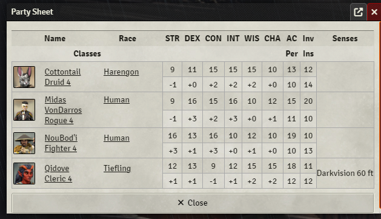
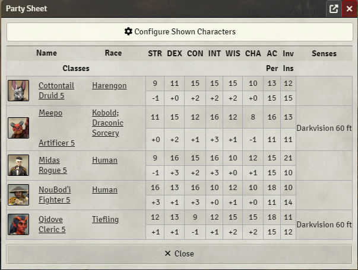

# Theater of the Mind - A [FoundryVTT](https://www.foundryvtt.com) Module

This module provides a GM with a table of characters, online only, or all, configurable in settings, in order to quickly see important stats, traits, abilites, etc. of all characters. Originally 5e only, it is now system agnostic and you can create easy to make .json templates for your system. It supports native Foundry and The Forge. Complete instructions for creating templates and placing them in the right folder on Foundry and Forge are included in the [SYSTEMS.MD] file.

The original intent of this module was to provide a 'party view' feature that I found missing when I first started using [FoundryVTT](https://www.foundryvtt.com) instead of [Fantasy Grounds](https://www.fantasygrounds.com). It will be updated with features that I personally want or need, or are requested of me by some poor soul. Several templates for various systems have been created, and more are already in the works with even more planned.

If you create a template, please submit it via email, Discord or GitHub as a Pull Request, and we will include it in future updates with full credit.

## Features
- Adds a 'Party Sheet' similar to that provided by Fantasy Grounds. Just click the Party Sheet icon on the Tokens Controls sub-menu.

  - The Party Sheet can be configured via the options to either display only currently connected players, or all non-npc characters. When using the all-characters display, there is a separate dialog to allow hiding of any characters the DM doesn't need to worry about. See the [SYSTEMS.md](SYSTEMS.md) file for instructions on how to create a json file for your own system.

  - Clicking a character portrait will open their sheet.

  - The Party Sheet is no longer bound to simply the built-in dnd5e system. Additional systems can be supported by writing a JSON file following the guidelines in [SYSTEMS.md](SYSTEMS.md) and placing it in either:

    - Native Foundry: your <FOUNDRY_VTT/Data/totm/> folder.
    - The Forge: the folder named [totm] at the top level of your assets library (created by the module).

- Sound effects support if you have Syrinscape ([fvtt-syrin-control](https://github.com/frondeus/fvtt-syrin-control)) and Midi QOL ([midi-qol](https://gitlab.com/tposney/midi-qol/)) installed.

# Support

Feel free to file a Bug Report / Feature Request under the Issues tab of Github.

Or you can join my **Discord** server here: https://discord.gg/XuGx7zNMKZ

# Screenshots

Primary Icon:

Only Connected Players:

Specific Characters

# Supported Systems

Built in (by Eddie Dover):
  - DnD5e "dnd5e" - Note: this does not require any upload of a .json, but you can make your own or edit the example in the [example_templates] folder to your liking and it will show up in the dropdown of available .json files

Templates by Michael Card (Emo Cthulhu):
  - Alien RPG "alienrpg"
  - Blade Runner RPG "blade-runner"
  - Dragonbane "dragonbane"
  - Starfinder "sfrpg"
  - The Walking Dead Universe RPG "twdu"
  - Vaesen "vaesen"

  - In Progress: Coriolis "yzecoriolis", Fallout 2d20 "fallout", Cyberpunk RED "cyberpunk-red-core"

  - Planned: Pathfinder 1e, Pathfinder 2e

Please see the [SYSTEMS.md](SYSTEMS.md) file for how to use the provided templates and install them in the correct directory. Theater of the Mind supports Forge installations, and information in these documents will let you know what you have to do differently on native Foundry and The Forge.
