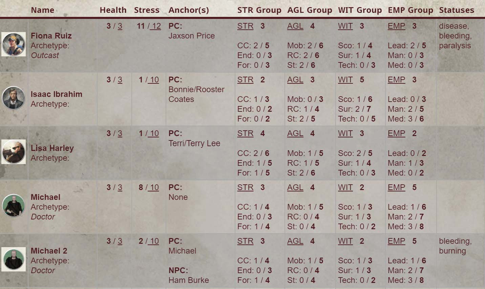
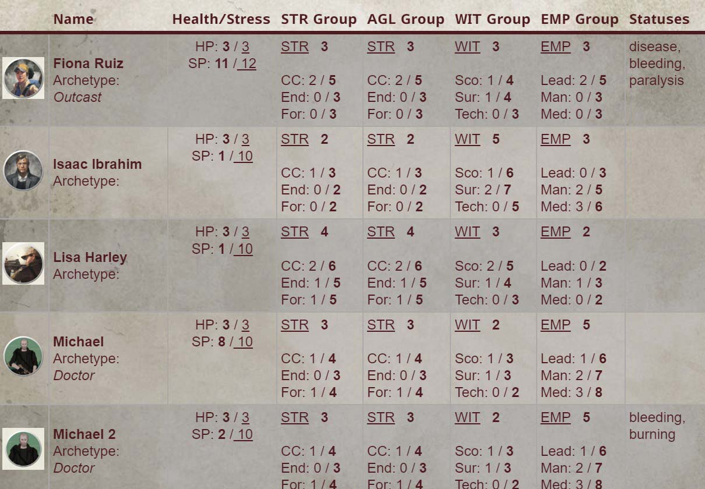
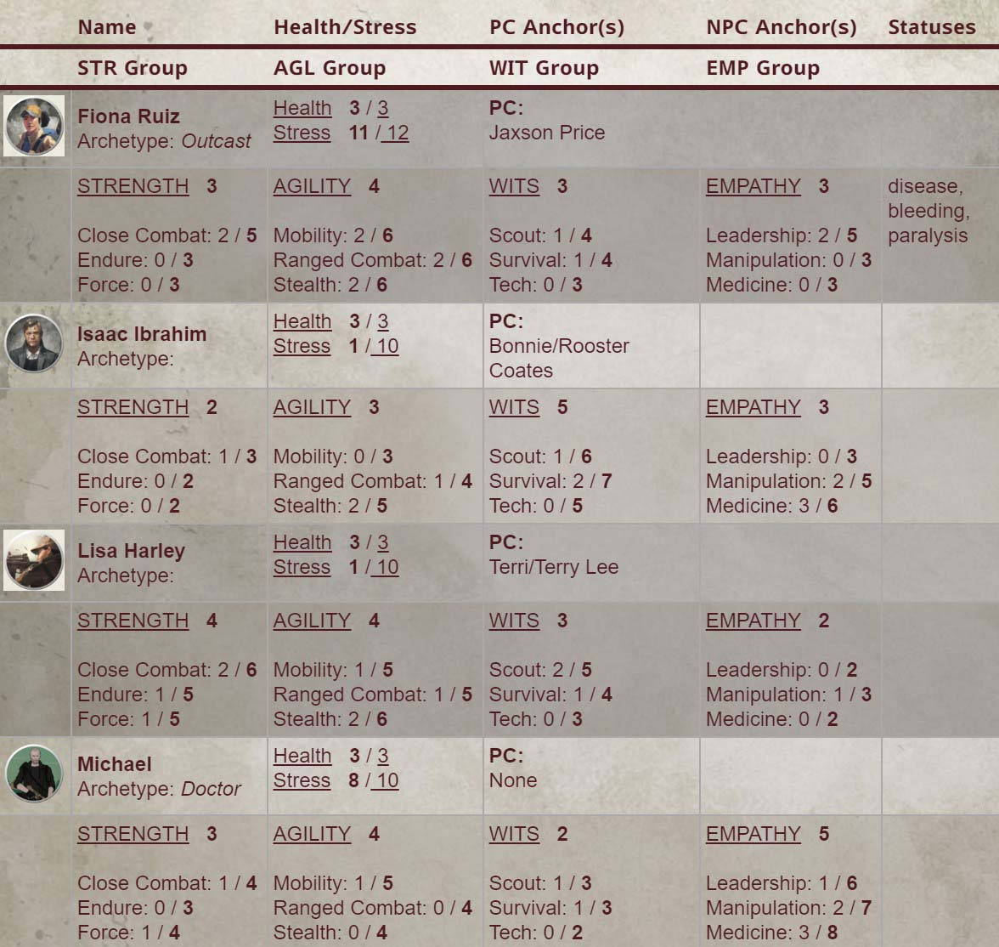

# Theater Of the Mind Template List

Please unfold any entry to see a screenshot.

## DnD5e "dnd5e"

  
  

  Built-In & dnd5e_template.json (Eddie Dover)
   
  - Note: this does not require any upload of a .json, but you can make your own or edit the examples in the [example_templates] folder to your liking and it will show up in the dropdown of available .json files
  

dnd5e_modified.json - Michael Card (Emo Cthulhu)

## Alien RPG "alienrpg"

alienrpg.json - Michael Card (Emo Cthulhu) _Note: any changes needed for Building Better Worlds will be available in next update._

## Blade Runner RPG "blade-runner"

blade-runner-basic.json - Michael Card (Emo Cthulhu)

blade-runner-expanded.json - Michael Card (Emo Cthulhu)

## Dragonbane "dragonbane"

dragonbane-name.json - Michael Card (Emo Cthulhu)

dragonbane-no-name.json - Michael Card (Emo Cthulhu)

## Fallout 2d20 "fallout"

fallout.json - Michael Card (Emo Cthulhu)

## Starfinder "sfrpg"

starfinder.json - Michael Card (Emo Cthulhu)

## Savage Worlds "swade"

swade.json - Mestre Digital

## The Walking Dead Universe RPG "twdu"

twdu-anchors.json - Michael Card (Emo Cthulhu)

twdu-no-anchors.json - Michael Card (Emo Cthulhu)

twdu-two-rows.json - Michael Card (Emo Cthulhu)

## Vaesen "vaesen"

vaesen.json - Michael Card (Emo Cthulhu)

